# Workflow Waterfall

A really basic Bash script for generating [GitHub Actions] workflow runs waterfall charts in
[Mermaid] Gantt charts format.

## Prerequisites

WW requires a working stallation of the `gh` CLI too.

## Usage

Download the `ww.sh` script, and execute as either:

```sh
ww.sh <run-url> > mermaid.txt
```

or 

```sh
ww.sh <owner> <repo> <run_id> [<attempt_number>] > mermaid.txt
```

The resulting `mermaid.txt` can then be rendered by any tool that supports [Mermaid] diagrams.

Here's a basic example:

```sh
./ww.sh https://github.com/pcolby/dokit/actions/runs/6159042763
---
displayMode: compact
---
gantt
  title Build and Test (run 6159042763, attempt 1)
  dateFormat YYYY-MM-DDTHH:MM:SS.SSSZ
  %% https://github.com/pcolby/dokit/actions/runs/6159042763

  section linux (6.6.0, clang, clang++, false)
  Set up job :2023-09-12T21:55:28.000+10:00, 4s
  Run actions/checkout@v4 :2023-09-12T21:55:32.000+10:00, 1s
  Install Tools :2023-09-12T21:55:33.000+10:00, 108s
  Install Qt :2023-09-12T21:57:21.000+10:00, 46s
  Install linuxdeploy :2023-09-12T21:58:07.000+10:00, 2s
  Build :2023-09-12T21:58:09.000+10:00, 227s
  Test :2023-09-12T22:01:57.000+10:00, 1s
  Upload test results :2023-09-12T22:01:58.000+10:00, 3s
  Build AppImage :2023-09-12T22:02:01.000+10:00, 12s
  Upload build artifacts :2023-09-12T22:02:13.000+10:00, 1s
  Upload AppImage :2023-09-12T22:02:14.000+10:00, 8s

  section linux (6.6.0, gcc, g++, true)
  Set up job :2023-09-12T21:55:27.000+10:00, 3s
  Run actions/checkout@v4 :2023-09-12T21:55:30.000+10:00, 1s
  Install Tools :2023-09-12T21:55:31.000+10:00, 114s
  Install Qt :2023-09-12T21:57:25.000+10:00, 41s
  Install linuxdeploy :2023-09-12T21:58:06.000+10:00, 1s
  Build :2023-09-12T21:58:08.000+10:00, 253s
  Test :2023-09-12T22:02:22.000+10:00, 2s
  Collate test coverage :2023-09-12T22:02:24.000+10:00, 8s
  Upload test results :2023-09-12T22:02:32.000+10:00, 1s
  Report parallel coverage to Codacy :2023-09-12T22:02:33.000+10:00, 3s
  Build AppImage :2023-09-12T22:02:37.000+10:00, 12s
  Upload AppImage :2023-09-12T22:02:49.000+10:00, 8s

  section linux0 (clang, clang++, false)
  Set up job :2023-09-12T21:55:27.000+10:00, 1s
  Run actions/checkout@v4 :2023-09-12T21:55:28.000+10:00, 1s
  Install Qt :2023-09-12T21:55:30.000+10:00, 115s
  Build :2023-09-12T21:57:27.000+10:00, 151s
  Test :2023-09-12T21:59:58.000+10:00, 1s
  Upload test results :2023-09-12T22:00:00.000+10:00, 1s
  Build AppImage :2023-09-12T22:00:01.000+10:00, 15s
  Upload AppImage :2023-09-12T22:00:17.000+10:00, 7s

  section linux0 (gcc, g++, true)
  Set up job :2023-09-12T21:55:29.000+10:00, 2s
  Run actions/checkout@v4 :2023-09-12T21:55:31.000+10:00, 2s
  Install Qt :2023-09-12T21:55:33.000+10:00, 155s
  Install linuxdeploy :2023-09-12T21:58:08.000+10:00, 2s
  Build :2023-09-12T21:58:11.000+10:00, 195s
  Test :2023-09-12T22:01:27.000+10:00, 2s
  Collate test coverage :2023-09-12T22:01:29.000+10:00, 7s
  Upload test results :2023-09-12T22:01:37.000+10:00, 5s
  Report parallel coverage to Codacy :2023-09-12T22:01:43.000+10:00, 2s
  Report parallel coverage to Coveralls :2023-09-12T22:01:46.000+10:00, 1s
  Build AppImage :2023-09-12T22:01:47.000+10:00, 18s
  Upload AppImage :2023-09-12T22:02:07.000+10:00, 11s

  section mac (6.6.0, clang, clang++, false)
  Set up job :2023-09-12T21:55:32.000+10:00, 5s
  Run actions/checkout@v4 :2023-09-12T21:55:37.000+10:00, 3s
  Install lcov :2023-09-12T21:55:40.000+10:00, 12s
  Install Qt :2023-09-12T21:55:52.000+10:00, 108s
  Build :2023-09-12T21:57:41.000+10:00, 608s
  Test :2023-09-12T22:07:50.000+10:00, 7s
  Upload test results :2023-09-12T22:07:57.000+10:00, 1s
  Make app bundle :2023-09-12T22:07:58.000+10:00, 15s
  Upload artifacts :2023-09-12T22:08:13.000+10:00, 25s
  Post Run actions/checkout@v4 :2023-09-12T22:08:38.000+10:00, 1s

  section win (6.6.0, MinGW Makefiles, x86-64)
  Set up job :2023-09-12T21:55:31.000+10:00, 3s
  Run actions/checkout@v4 :2023-09-12T21:55:34.000+10:00, 7s
  Install Qt :2023-09-12T21:55:42.000+10:00, 61s
  Build :2023-09-12T21:56:43.000+10:00, 357s
  Test :2023-09-12T22:02:40.000+10:00, 3s
  Upload test results :2023-09-12T22:02:43.000+10:00, 2s
  Make portable :2023-09-12T22:02:45.000+10:00, 1s
  Upload artifacts (portable) :2023-09-12T22:02:47.000+10:00, 3s
  Post Run actions/checkout@v4 :2023-09-12T22:02:51.000+10:00, 1s

  section win (6.6.0, NMake Makefiles, x86-64)
  Set up job :2023-09-12T21:55:31.000+10:00, 6s
  Run actions/checkout@v4 :2023-09-12T21:55:37.000+10:00, 8s
  Install Qt :2023-09-12T21:55:45.000+10:00, 79s
  Configure MSVC :2023-09-12T21:57:04.000+10:00, 7s
  Build :2023-09-12T21:57:12.000+10:00, 431s
  Test :2023-09-12T22:04:23.000+10:00, 21s
  Upload test results :2023-09-12T22:04:44.000+10:00, 7s
  Make portable :2023-09-12T22:04:51.000+10:00, 3s
  Upload artifacts :2023-09-12T22:04:54.000+10:00, 2s
  Upload artifacts (portable) :2023-09-12T22:04:56.000+10:00, 24s
  Post Install Qt :2023-09-12T22:05:20.000+10:00, 1s
  Post Run actions/checkout@v4 :2023-09-12T22:05:21.000+10:00, 2s

  section win (6.6.0, NMake Makefiles, arm64)
  Set up job :2023-09-12T21:55:32.000+10:00, 3s
  Run actions/checkout@v4 :2023-09-12T21:55:35.000+10:00, 10s
  Install host Qt for cross-compilation :2023-09-12T21:55:45.000+10:00, 116s
  Install Qt :2023-09-12T21:57:43.000+10:00, 53s
  Configure MSVC :2023-09-12T21:58:37.000+10:00, 8s
  Build :2023-09-12T21:58:45.000+10:00, 508s
  Post Run actions/checkout@v4 :2023-09-12T22:07:15.000+10:00, 2s

  section collate-test-results
  Set up job :2023-09-12T22:08:48.000+10:00, 3s
  Run actions/checkout@v4 :2023-09-12T22:08:51.000+10:00, 2s
  Install lcov :2023-09-12T22:08:53.000+10:00, 123s
  Download all artifacts :2023-09-12T22:10:56.000+10:00, 77s
  Upload HTML coverage report :2023-09-12T22:12:15.000+10:00, 21s
  Report partial-finished to Codacy :2023-09-12T22:12:37.000+10:00, 1s
  Complete job :2023-09-12T22:12:39.000+10:00, 1s

  section update-tests-on-doc-branch
  Set up job :2023-09-12T22:12:52.000+10:00, 2s
  Run actions/checkout@v4 :2023-09-12T22:12:54.000+10:00, 5s
  Download HTML report :2023-09-12T22:12:59.000+10:00, 19s
  Inspect changes :2023-09-12T22:13:18.000+10:00, 1s
  Run sleep 60 false :crit, 2023-09-12T22:13:20.000+10:00, 59s
```

Which, on GitHub, renders like:

```mermaid
---
displayMode: compact
---
gantt
  title Build and Test (run 6159042763, attempt 1)
  dateFormat YYYY-MM-DDTHH:MM:SS.SSSZ
  %% https://github.com/pcolby/dokit/actions/runs/6159042763

  section linux (6.6.0, clang, clang++, false)
  Set up job :2023-09-12T21:55:28.000+10:00, 4s
  Run actions/checkout@v4 :2023-09-12T21:55:32.000+10:00, 1s
  Install Tools :2023-09-12T21:55:33.000+10:00, 108s
  Install Qt :2023-09-12T21:57:21.000+10:00, 46s
  Install linuxdeploy :2023-09-12T21:58:07.000+10:00, 2s
  Build :2023-09-12T21:58:09.000+10:00, 227s
  Test :2023-09-12T22:01:57.000+10:00, 1s
  Upload test results :2023-09-12T22:01:58.000+10:00, 3s
  Build AppImage :2023-09-12T22:02:01.000+10:00, 12s
  Upload build artifacts :2023-09-12T22:02:13.000+10:00, 1s
  Upload AppImage :2023-09-12T22:02:14.000+10:00, 8s

  section linux (6.6.0, gcc, g++, true)
  Set up job :2023-09-12T21:55:27.000+10:00, 3s
  Run actions/checkout@v4 :2023-09-12T21:55:30.000+10:00, 1s
  Install Tools :2023-09-12T21:55:31.000+10:00, 114s
  Install Qt :2023-09-12T21:57:25.000+10:00, 41s
  Install linuxdeploy :2023-09-12T21:58:06.000+10:00, 1s
  Build :2023-09-12T21:58:08.000+10:00, 253s
  Test :2023-09-12T22:02:22.000+10:00, 2s
  Collate test coverage :2023-09-12T22:02:24.000+10:00, 8s
  Upload test results :2023-09-12T22:02:32.000+10:00, 1s
  Report parallel coverage to Codacy :2023-09-12T22:02:33.000+10:00, 3s
  Build AppImage :2023-09-12T22:02:37.000+10:00, 12s
  Upload AppImage :2023-09-12T22:02:49.000+10:00, 8s

  section linux0 (clang, clang++, false)
  Set up job :2023-09-12T21:55:27.000+10:00, 1s
  Run actions/checkout@v4 :2023-09-12T21:55:28.000+10:00, 1s
  Install Qt :2023-09-12T21:55:30.000+10:00, 115s
  Build :2023-09-12T21:57:27.000+10:00, 151s
  Test :2023-09-12T21:59:58.000+10:00, 1s
  Upload test results :2023-09-12T22:00:00.000+10:00, 1s
  Build AppImage :2023-09-12T22:00:01.000+10:00, 15s
  Upload AppImage :2023-09-12T22:00:17.000+10:00, 7s

  section linux0 (gcc, g++, true)
  Set up job :2023-09-12T21:55:29.000+10:00, 2s
  Run actions/checkout@v4 :2023-09-12T21:55:31.000+10:00, 2s
  Install Qt :2023-09-12T21:55:33.000+10:00, 155s
  Install linuxdeploy :2023-09-12T21:58:08.000+10:00, 2s
  Build :2023-09-12T21:58:11.000+10:00, 195s
  Test :2023-09-12T22:01:27.000+10:00, 2s
  Collate test coverage :2023-09-12T22:01:29.000+10:00, 7s
  Upload test results :2023-09-12T22:01:37.000+10:00, 5s
  Report parallel coverage to Codacy :2023-09-12T22:01:43.000+10:00, 2s
  Report parallel coverage to Coveralls :2023-09-12T22:01:46.000+10:00, 1s
  Build AppImage :2023-09-12T22:01:47.000+10:00, 18s
  Upload AppImage :2023-09-12T22:02:07.000+10:00, 11s

  section mac (6.6.0, clang, clang++, false)
  Set up job :2023-09-12T21:55:32.000+10:00, 5s
  Run actions/checkout@v4 :2023-09-12T21:55:37.000+10:00, 3s
  Install lcov :2023-09-12T21:55:40.000+10:00, 12s
  Install Qt :2023-09-12T21:55:52.000+10:00, 108s
  Build :2023-09-12T21:57:41.000+10:00, 608s
  Test :2023-09-12T22:07:50.000+10:00, 7s
  Upload test results :2023-09-12T22:07:57.000+10:00, 1s
  Make app bundle :2023-09-12T22:07:58.000+10:00, 15s
  Upload artifacts :2023-09-12T22:08:13.000+10:00, 25s
  Post Run actions/checkout@v4 :2023-09-12T22:08:38.000+10:00, 1s

  section win (6.6.0, MinGW Makefiles, x86-64)
  Set up job :2023-09-12T21:55:31.000+10:00, 3s
  Run actions/checkout@v4 :2023-09-12T21:55:34.000+10:00, 7s
  Install Qt :2023-09-12T21:55:42.000+10:00, 61s
  Build :2023-09-12T21:56:43.000+10:00, 357s
  Test :2023-09-12T22:02:40.000+10:00, 3s
  Upload test results :2023-09-12T22:02:43.000+10:00, 2s
  Make portable :2023-09-12T22:02:45.000+10:00, 1s
  Upload artifacts (portable) :2023-09-12T22:02:47.000+10:00, 3s
  Post Run actions/checkout@v4 :2023-09-12T22:02:51.000+10:00, 1s

  section win (6.6.0, NMake Makefiles, x86-64)
  Set up job :2023-09-12T21:55:31.000+10:00, 6s
  Run actions/checkout@v4 :2023-09-12T21:55:37.000+10:00, 8s
  Install Qt :2023-09-12T21:55:45.000+10:00, 79s
  Configure MSVC :2023-09-12T21:57:04.000+10:00, 7s
  Build :2023-09-12T21:57:12.000+10:00, 431s
  Test :2023-09-12T22:04:23.000+10:00, 21s
  Upload test results :2023-09-12T22:04:44.000+10:00, 7s
  Make portable :2023-09-12T22:04:51.000+10:00, 3s
  Upload artifacts :2023-09-12T22:04:54.000+10:00, 2s
  Upload artifacts (portable) :2023-09-12T22:04:56.000+10:00, 24s
  Post Install Qt :2023-09-12T22:05:20.000+10:00, 1s
  Post Run actions/checkout@v4 :2023-09-12T22:05:21.000+10:00, 2s

  section win (6.6.0, NMake Makefiles, arm64)
  Set up job :2023-09-12T21:55:32.000+10:00, 3s
  Run actions/checkout@v4 :2023-09-12T21:55:35.000+10:00, 10s
  Install host Qt for cross-compilation :2023-09-12T21:55:45.000+10:00, 116s
  Install Qt :2023-09-12T21:57:43.000+10:00, 53s
  Configure MSVC :2023-09-12T21:58:37.000+10:00, 8s
  Build :2023-09-12T21:58:45.000+10:00, 508s
  Post Run actions/checkout@v4 :2023-09-12T22:07:15.000+10:00, 2s

  section collate-test-results
  Set up job :2023-09-12T22:08:48.000+10:00, 3s
  Run actions/checkout@v4 :2023-09-12T22:08:51.000+10:00, 2s
  Install lcov :2023-09-12T22:08:53.000+10:00, 123s
  Download all artifacts :2023-09-12T22:10:56.000+10:00, 77s
  Upload HTML coverage report :2023-09-12T22:12:15.000+10:00, 21s
  Report partial-finished to Codacy :2023-09-12T22:12:37.000+10:00, 1s
  Complete job :2023-09-12T22:12:39.000+10:00, 1s

  section update-tests-on-doc-branch
  Set up job :2023-09-12T22:12:52.000+10:00, 2s
  Run actions/checkout@v4 :2023-09-12T22:12:54.000+10:00, 5s
  Download HTML report :2023-09-12T22:12:59.000+10:00, 19s
  Inspect changes :2023-09-12T22:13:18.000+10:00, 1s
  Run sleep 60 false :crit, 2023-09-12T22:13:20.000+10:00, 59s
```



Note, GitHub's Mermaid does not honor the `displayMode: compact` option, so it renders in
non-compact mode (other tools, such as the [Mermaid Live Editor] have more compact output).

You can view the above example via the [Mermaid Live Editor] with the follwoing links:

* [with compact display mode](https://mermaid.live/view#pako:eNqlmGFvozYYx7-KhXRSTw0JNjYQv9p23XYnXabt0m3aKW8ccBJWghE4d82qfvcZSNsYDIW0L9oo9d9-7Of3PP7DgxWKiFvUsm17lUZxkSXsuFBfURCKfcZCuUqrf21ZKtVnAGQsEw5-OsRJBFgagVteSHCVH1LgQTJ3MPI9dwKYlHyfSQDfl5qISf6LyPdMgn_Uj71Y2Dc3tx8_0sWCLpfT5XL5tRz27h3YSZkVdDbbxnJ3WE9VDLMsFMn6OIvEXSxnKqBYpMVMrVfMXhZcpaW-4NV_QRKnh3tw5U29qTMBYcLS7enP9fUEbFhS8CqsJZfgkIF_xRpQ5CDXduY2RLcIUkIoCqaO41xDhzpqElyUgi9ql08RhDse3omD_OEbNqhddK6GlfpTWkiWJOBWiKQwaVxN4wSa6g_ZkvgUQS1IT1NUxxDxLBHHljSgjn8uRZWyzqph7Fwbi_xqdJV5bTCiThlWe-t_qiBYBGSpyHlxSGRhUmpH7p6F9GOWfdqzLW-JSp22HDpfb11Tmst4o9JWGNTQ7Qy2Z02Iz1Vlnrrx24ah-lWCJ_PDEO789iGM4M65gDv9BCEewB3RuINjuPPaEXZypwGBiNvNHaIItYH-IJJE9Z4avFB847k5oaiV0GHMImOhf-GZyCXIWK6OgycvC0uhIopYeDRN5F4Av-t3w98jw_NX-XXA1aWN01D_wwHW2y58DcUW8ZD0EOU3gyOwgyg1eN7oR8M7WTm-C_LOrDjNTkYGJdOhUNuS35HM0W1o3q6mEW0IttX9WdT7MCFjOkow_CaD-hnPSd9NhvxLOwpsnJ8_4hbUa5pc2lEgxa4hhb0TlZ-TxBQU9kYDrUR6sQUDu5PuTCBsEL1n4Vu9nd60yVi4DTf0M6nqQA0S7Bj6dG9BEGQyg11tDWtYe6fRRqx9SpzL0PSN1m7B7jhgWabMVhol3KQKuvtatzcLGt4M1brfhYpwUK6qOdxWCz9H6XucPqO0iNNf_652s4kTXkzAfeDZHh4AE3yTYcPtZPSCgTUwvD4D5TVagEv8PgOlQ-qOMEGmTlNxUTYbtk6MHoR0Xq4vUFw9TfDeNIOhDkfhgSiBQ_H4rdrPm_Hw3tRrggF4aMfqz0-XVrqJt4dcbWD51wdD_3AMFHb1GqgBiF3YzRSmSCdjuIfCFBti6ocKN_LpDus0Sobb_I5hUc2g3Y8Iv8DYlS0lUy7L4BNHIUwarwDQGIRZvh9EMHpTg9Pr3NEQ3pV7VSezETkIc1EUdvnWKVYOqwz-Nboh9F5_VNV70-kR8pWCCIx11-Up9aDI6fIdlUZVVaQvjWHtOu2yZOxTyfTlrbr7cHBh3io16bHwbZdTS3QTj-olb8T3tC4lpeysQiXSa8jXjMnH28XnF7Oa1y62OQVqnmLzcVzGLLE3cRoXOx51e2fYerA-QbPPEq68v-G4S8m87y45ZNFTAgtbpHYkQnudszTc9edRTUzQhY9itRq3ve5zSqpj7TxNou9o_sRApvYEwp3y3LydR5fCwPwCoEg4z5Q5rV06oGEeS7WfplzviWReWBNrz_M9iyOLWg_lbCtL7vieryyqPkYsv1tZq_RRjatP-ecoliK3aLXOxGIHKZbHNHz-oh51E7NtzvbP32YsteiDdW9RD05dFLjEmWPsORjhiXW0KFSdhHg-wr7nIN_zoP84sf4TQs3gTAPkBV6AfTUYuQHyJxavgljUb9erl-zVEl8rQfkM_vg_qOs8lQ)
* [without compact display mode](https://mermaid.live/view#pako:eNqlmO9vozYYx_8VC-mknhoSbGx--NW267Y76TJtl27TTnnjgJuwEozAuWtX9X-fgbSNwVBI-6KNUn_tx34-z-MvPFiRiLlFrS3LpFxnAMhEphz8dEjSGLAsBte8lOCiOGTAgyR0MPI9dwaYlHyfSwDfV5qYSf6LKPZMgn_Uj71c2ldX1x8_0uWSrlbz1Wr1tRr27h3YSZmXdLHYJnJ32MwjsV_kkUg394tY3CZywSKZiKxcqPXKxcuC66zSl7z-L0iT7HAHLry5N3dmIEpZtj3-ubycgRuWlrwOa8UlOOTgX7EBFDnItZ3QhugaQUoIRcHccZxL6FBHTYLLSvBF7fIpgmjHo1txkD98wwa1i07VsFZ_ykrJ0hRcC5GWJo2raZxAU_0hOxKfIqgF6WmK-hhinqfiviMNqOOfSlGtbLJqGBtqY5Ffj64zrw1G1KnC6m79TxUEi4GsFAUvD6ksTUrtyN2TkH7M8097tuUdUaXTlkOn620aSguZ3Ki0lQY1dHuDHVgT4lNVlad-_LZRpH5V4MniMIY7v3sIE7hzzuBOP0GIR3BHNO7gFO68boS93GlAIOL2c4coQl2gP4g0Vb2nAS8S33hhTijqJHQcs8hY6F94LgoJclao4-Dpy8JSqIhiFt2bJnLPgN_1--EfkOHwVX4dcHFu4zTU_3iA9bYLX0OxQzwkA0T57eAI7CFKDQ5b_Wh8J6vG90HemxWn3cnIqGQ6FGpb8nuSObkNhd1qmtCGYFc9nEW9DxMypaME428yqJ9xSIZuMuSf21Fg6_z8CbegXtPk3I4CKXYNKRycqPqcpqagsDcZaCXSiy0Y2Z10ZwJhi-g9i97q7fSmTabCbbihn0lVB2qQYMfQpwcLgiCTGexra1jD2juONmLtU-Kch6ZvtHZLdssBy3NltrI45SZV0N_X-r1Z0PJmqNH9LlSEo3JVz-F2WvgpSt-T7BmlZZL9-ne9m5sk5eUM3AWe7eERMME3GTbcTcYgGFgDwxsyUF6rBbjEHzJQOqTuBBNk6jQ1F1WzYZvU6EFI7-X6AsXF0wTvTTMY6nASHogSOBaP3-r9vBkP7029JhiBh3asfni8tLKbZHso1AZWf30w9A_HQGFfr4EagNiF_UxhinQyxnsoTLEhpmGocCuf7rhOo2S4y-8UFtUM2v2I8AuMfdlSMuWyDD5xEsKk9QoATUGYFftRBKM3NTi9zh0N4V21V3UyN6IAUSHK0o7EPk-Uw6qCf41uCL3XH1X13nR8hHylIAJj3fV5Sj0ocrx8J6VRVRUZSmPUuE67Khn7WDJDeavvPhycmbdaTQYsfNflNBLdxKNmySvxPWtKSSl7q1CJ9BryNWPy8Xr5-cWsFo2LbU-B2qfYfhyXCUvtmyRLyh2P-70z7DxYH6HZ5ylX3t9w3JUkHLpLDnn8lMDSFpkdi8jeFCyLdsN5VBMTdOajWKPGXa_7nJL6WHtPk-g7Cp8YyNWeQLRTnpt38-hSGJhfAJQp57kyp41LBzQqEqn205brPZGEpTWz9rzYsyS2qPVQzba25I7v-dqi6mPMitu1tc4e1bjmlH-OEykKi9brzCx2kGJ1n0XPXzSjrhK2Ldj--ducZRZ9sO4s6vtziKDv4cALAwx9d2bdWyo0OMcehg52AwQd4rmPM-s_IdQMzjx0QkKw74cEhcSHZGbxOohl8_a8foleL_G1FlTP4I__A1fQMXM)

[GitHub Actions]: https://github.com/features/actions
[Mermaid]:        https://mermaid.js.org/ "Mermaid Diagramming and charting tool"
[Mermaid Live Editor]: https://mermaid.live "Mermaid Live Editor"
