# Workflow Waterfall

A really basic Bash script for generating [GitHub Actions] workflow runs waterfall charts in
[Mermaid] Gantt charts format.

## Prerequisites

WW requires a working stallation of the `gh` CLI too.

## Usage

Download the `ww.sh` script, and execute as either:

```sh
ww.sh <run-url> > mermaid.txt
```

or 

```sh
ww.sh <owner> <repo> <run_id> [<attempt_number>] > mermaid.txt
```

The resulting `mermaid.txt` can then be rendered by any tool that supports [Mermaid] diagrams.

Here's a basic example:

```sh
./ww.sh https://github.com/pcolby/dokit/actions/runs/6159042763
---
displayMode: compact
---
gantt
  title Build and Test (run 6159042763, attempt 1)
  dateFormat YYYY-MM-DDTHH:MM:SS.SSSZ
  %% https://github.com/pcolby/dokit/actions/runs/6159042763

  section linux (6.6.0, clang, clang++, false)
  Set up job :2023-09-12T21:55:28.000+10:00, 4s
  Run actions/checkout@v4 :2023-09-12T21:55:32.000+10:00, 1s
  Install Tools :2023-09-12T21:55:33.000+10:00, 108s
  Install Qt :2023-09-12T21:57:21.000+10:00, 46s
  Install linuxdeploy :2023-09-12T21:58:07.000+10:00, 2s
  Build :2023-09-12T21:58:09.000+10:00, 227s
  Test :2023-09-12T22:01:57.000+10:00, 1s
  Upload test results :2023-09-12T22:01:58.000+10:00, 3s
  Build AppImage :2023-09-12T22:02:01.000+10:00, 12s
  Upload build artifacts :2023-09-12T22:02:13.000+10:00, 1s
  Upload AppImage :2023-09-12T22:02:14.000+10:00, 8s

  section linux (6.6.0, gcc, g++, true)
  Set up job :2023-09-12T21:55:27.000+10:00, 3s
  Run actions/checkout@v4 :2023-09-12T21:55:30.000+10:00, 1s
  Install Tools :2023-09-12T21:55:31.000+10:00, 114s
  Install Qt :2023-09-12T21:57:25.000+10:00, 41s
  Install linuxdeploy :2023-09-12T21:58:06.000+10:00, 1s
  Build :2023-09-12T21:58:08.000+10:00, 253s
  Test :2023-09-12T22:02:22.000+10:00, 2s
  Collate test coverage :2023-09-12T22:02:24.000+10:00, 8s
  Upload test results :2023-09-12T22:02:32.000+10:00, 1s
  Report parallel coverage to Codacy :2023-09-12T22:02:33.000+10:00, 3s
  Build AppImage :2023-09-12T22:02:37.000+10:00, 12s
  Upload AppImage :2023-09-12T22:02:49.000+10:00, 8s

  section linux0 (clang, clang++, false)
  Set up job :2023-09-12T21:55:27.000+10:00, 1s
  Run actions/checkout@v4 :2023-09-12T21:55:28.000+10:00, 1s
  Install Qt :2023-09-12T21:55:30.000+10:00, 115s
  Build :2023-09-12T21:57:27.000+10:00, 151s
  Test :2023-09-12T21:59:58.000+10:00, 1s
  Upload test results :2023-09-12T22:00:00.000+10:00, 1s
  Build AppImage :2023-09-12T22:00:01.000+10:00, 15s
  Upload AppImage :2023-09-12T22:00:17.000+10:00, 7s

  section linux0 (gcc, g++, true)
  Set up job :2023-09-12T21:55:29.000+10:00, 2s
  Run actions/checkout@v4 :2023-09-12T21:55:31.000+10:00, 2s
  Install Qt :2023-09-12T21:55:33.000+10:00, 155s
  Install linuxdeploy :2023-09-12T21:58:08.000+10:00, 2s
  Build :2023-09-12T21:58:11.000+10:00, 195s
  Test :2023-09-12T22:01:27.000+10:00, 2s
  Collate test coverage :2023-09-12T22:01:29.000+10:00, 7s
  Upload test results :2023-09-12T22:01:37.000+10:00, 5s
  Report parallel coverage to Codacy :2023-09-12T22:01:43.000+10:00, 2s
  Report parallel coverage to Coveralls :2023-09-12T22:01:46.000+10:00, 1s
  Build AppImage :2023-09-12T22:01:47.000+10:00, 18s
  Upload AppImage :2023-09-12T22:02:07.000+10:00, 11s

  section mac (6.6.0, clang, clang++, false)
  Set up job :2023-09-12T21:55:32.000+10:00, 5s
  Run actions/checkout@v4 :2023-09-12T21:55:37.000+10:00, 3s
  Install lcov :2023-09-12T21:55:40.000+10:00, 12s
  Install Qt :2023-09-12T21:55:52.000+10:00, 108s
  Build :2023-09-12T21:57:41.000+10:00, 608s
  Test :2023-09-12T22:07:50.000+10:00, 7s
  Upload test results :2023-09-12T22:07:57.000+10:00, 1s
  Make app bundle :2023-09-12T22:07:58.000+10:00, 15s
  Upload artifacts :2023-09-12T22:08:13.000+10:00, 25s
  Post Run actions/checkout@v4 :2023-09-12T22:08:38.000+10:00, 1s

  section win (6.6.0, MinGW Makefiles, x86-64)
  Set up job :2023-09-12T21:55:31.000+10:00, 3s
  Run actions/checkout@v4 :2023-09-12T21:55:34.000+10:00, 7s
  Install Qt :2023-09-12T21:55:42.000+10:00, 61s
  Build :2023-09-12T21:56:43.000+10:00, 357s
  Test :2023-09-12T22:02:40.000+10:00, 3s
  Upload test results :2023-09-12T22:02:43.000+10:00, 2s
  Make portable :2023-09-12T22:02:45.000+10:00, 1s
  Upload artifacts (portable) :2023-09-12T22:02:47.000+10:00, 3s
  Post Run actions/checkout@v4 :2023-09-12T22:02:51.000+10:00, 1s

  section win (6.6.0, NMake Makefiles, x86-64)
  Set up job :2023-09-12T21:55:31.000+10:00, 6s
  Run actions/checkout@v4 :2023-09-12T21:55:37.000+10:00, 8s
  Install Qt :2023-09-12T21:55:45.000+10:00, 79s
  Configure MSVC :2023-09-12T21:57:04.000+10:00, 7s
  Build :2023-09-12T21:57:12.000+10:00, 431s
  Test :2023-09-12T22:04:23.000+10:00, 21s
  Upload test results :2023-09-12T22:04:44.000+10:00, 7s
  Make portable :2023-09-12T22:04:51.000+10:00, 3s
  Upload artifacts :2023-09-12T22:04:54.000+10:00, 2s
  Upload artifacts (portable) :2023-09-12T22:04:56.000+10:00, 24s
  Post Install Qt :2023-09-12T22:05:20.000+10:00, 1s
  Post Run actions/checkout@v4 :2023-09-12T22:05:21.000+10:00, 2s

  section win (6.6.0, NMake Makefiles, arm64)
  Set up job :2023-09-12T21:55:32.000+10:00, 3s
  Run actions/checkout@v4 :2023-09-12T21:55:35.000+10:00, 10s
  Install host Qt for cross-compilation :2023-09-12T21:55:45.000+10:00, 116s
  Install Qt :2023-09-12T21:57:43.000+10:00, 53s
  Configure MSVC :2023-09-12T21:58:37.000+10:00, 8s
  Build :2023-09-12T21:58:45.000+10:00, 508s
  Post Run actions/checkout@v4 :2023-09-12T22:07:15.000+10:00, 2s

  section collate-test-results
  Set up job :2023-09-12T22:08:48.000+10:00, 3s
  Run actions/checkout@v4 :2023-09-12T22:08:51.000+10:00, 2s
  Install lcov :2023-09-12T22:08:53.000+10:00, 123s
  Download all artifacts :2023-09-12T22:10:56.000+10:00, 77s
  Upload HTML coverage report :2023-09-12T22:12:15.000+10:00, 21s
  Report partial-finished to Codacy :2023-09-12T22:12:37.000+10:00, 1s
  Complete job :2023-09-12T22:12:39.000+10:00, 1s

  section update-tests-on-doc-branch
  Set up job :2023-09-12T22:12:52.000+10:00, 2s
  Run actions/checkout@v4 :2023-09-12T22:12:54.000+10:00, 5s
  Download HTML report :2023-09-12T22:12:59.000+10:00, 19s
  Inspect changes :2023-09-12T22:13:18.000+10:00, 1s
  Run sleep 60 false :crit, 2023-09-12T22:13:20.000+10:00, 59s
```

Which, on GitHub, renders like:

```mermaid
---
displayMode: compact
---
gantt
  title Build and Test (run 6159042763, attempt 1)
  dateFormat YYYY-MM-DDTHH:MM:SS.SSSZ
  %% https://github.com/pcolby/dokit/actions/runs/6159042763

  section linux (6.6.0, clang, clang++, false)
  Set up job :2023-09-12T21:55:28.000+10:00, 4s
  Run actions/checkout@v4 :2023-09-12T21:55:32.000+10:00, 1s
  Install Tools :2023-09-12T21:55:33.000+10:00, 108s
  Install Qt :2023-09-12T21:57:21.000+10:00, 46s
  Install linuxdeploy :2023-09-12T21:58:07.000+10:00, 2s
  Build :2023-09-12T21:58:09.000+10:00, 227s
  Test :2023-09-12T22:01:57.000+10:00, 1s
  Upload test results :2023-09-12T22:01:58.000+10:00, 3s
  Build AppImage :2023-09-12T22:02:01.000+10:00, 12s
  Upload build artifacts :2023-09-12T22:02:13.000+10:00, 1s
  Upload AppImage :2023-09-12T22:02:14.000+10:00, 8s

  section linux (6.6.0, gcc, g++, true)
  Set up job :2023-09-12T21:55:27.000+10:00, 3s
  Run actions/checkout@v4 :2023-09-12T21:55:30.000+10:00, 1s
  Install Tools :2023-09-12T21:55:31.000+10:00, 114s
  Install Qt :2023-09-12T21:57:25.000+10:00, 41s
  Install linuxdeploy :2023-09-12T21:58:06.000+10:00, 1s
  Build :2023-09-12T21:58:08.000+10:00, 253s
  Test :2023-09-12T22:02:22.000+10:00, 2s
  Collate test coverage :2023-09-12T22:02:24.000+10:00, 8s
  Upload test results :2023-09-12T22:02:32.000+10:00, 1s
  Report parallel coverage to Codacy :2023-09-12T22:02:33.000+10:00, 3s
  Build AppImage :2023-09-12T22:02:37.000+10:00, 12s
  Upload AppImage :2023-09-12T22:02:49.000+10:00, 8s

  section linux0 (clang, clang++, false)
  Set up job :2023-09-12T21:55:27.000+10:00, 1s
  Run actions/checkout@v4 :2023-09-12T21:55:28.000+10:00, 1s
  Install Qt :2023-09-12T21:55:30.000+10:00, 115s
  Build :2023-09-12T21:57:27.000+10:00, 151s
  Test :2023-09-12T21:59:58.000+10:00, 1s
  Upload test results :2023-09-12T22:00:00.000+10:00, 1s
  Build AppImage :2023-09-12T22:00:01.000+10:00, 15s
  Upload AppImage :2023-09-12T22:00:17.000+10:00, 7s

  section linux0 (gcc, g++, true)
  Set up job :2023-09-12T21:55:29.000+10:00, 2s
  Run actions/checkout@v4 :2023-09-12T21:55:31.000+10:00, 2s
  Install Qt :2023-09-12T21:55:33.000+10:00, 155s
  Install linuxdeploy :2023-09-12T21:58:08.000+10:00, 2s
  Build :2023-09-12T21:58:11.000+10:00, 195s
  Test :2023-09-12T22:01:27.000+10:00, 2s
  Collate test coverage :2023-09-12T22:01:29.000+10:00, 7s
  Upload test results :2023-09-12T22:01:37.000+10:00, 5s
  Report parallel coverage to Codacy :2023-09-12T22:01:43.000+10:00, 2s
  Report parallel coverage to Coveralls :2023-09-12T22:01:46.000+10:00, 1s
  Build AppImage :2023-09-12T22:01:47.000+10:00, 18s
  Upload AppImage :2023-09-12T22:02:07.000+10:00, 11s

  section mac (6.6.0, clang, clang++, false)
  Set up job :2023-09-12T21:55:32.000+10:00, 5s
  Run actions/checkout@v4 :2023-09-12T21:55:37.000+10:00, 3s
  Install lcov :2023-09-12T21:55:40.000+10:00, 12s
  Install Qt :2023-09-12T21:55:52.000+10:00, 108s
  Build :2023-09-12T21:57:41.000+10:00, 608s
  Test :2023-09-12T22:07:50.000+10:00, 7s
  Upload test results :2023-09-12T22:07:57.000+10:00, 1s
  Make app bundle :2023-09-12T22:07:58.000+10:00, 15s
  Upload artifacts :2023-09-12T22:08:13.000+10:00, 25s
  Post Run actions/checkout@v4 :2023-09-12T22:08:38.000+10:00, 1s

  section win (6.6.0, MinGW Makefiles, x86-64)
  Set up job :2023-09-12T21:55:31.000+10:00, 3s
  Run actions/checkout@v4 :2023-09-12T21:55:34.000+10:00, 7s
  Install Qt :2023-09-12T21:55:42.000+10:00, 61s
  Build :2023-09-12T21:56:43.000+10:00, 357s
  Test :2023-09-12T22:02:40.000+10:00, 3s
  Upload test results :2023-09-12T22:02:43.000+10:00, 2s
  Make portable :2023-09-12T22:02:45.000+10:00, 1s
  Upload artifacts (portable) :2023-09-12T22:02:47.000+10:00, 3s
  Post Run actions/checkout@v4 :2023-09-12T22:02:51.000+10:00, 1s

  section win (6.6.0, NMake Makefiles, x86-64)
  Set up job :2023-09-12T21:55:31.000+10:00, 6s
  Run actions/checkout@v4 :2023-09-12T21:55:37.000+10:00, 8s
  Install Qt :2023-09-12T21:55:45.000+10:00, 79s
  Configure MSVC :2023-09-12T21:57:04.000+10:00, 7s
  Build :2023-09-12T21:57:12.000+10:00, 431s
  Test :2023-09-12T22:04:23.000+10:00, 21s
  Upload test results :2023-09-12T22:04:44.000+10:00, 7s
  Make portable :2023-09-12T22:04:51.000+10:00, 3s
  Upload artifacts :2023-09-12T22:04:54.000+10:00, 2s
  Upload artifacts (portable) :2023-09-12T22:04:56.000+10:00, 24s
  Post Install Qt :2023-09-12T22:05:20.000+10:00, 1s
  Post Run actions/checkout@v4 :2023-09-12T22:05:21.000+10:00, 2s

  section win (6.6.0, NMake Makefiles, arm64)
  Set up job :2023-09-12T21:55:32.000+10:00, 3s
  Run actions/checkout@v4 :2023-09-12T21:55:35.000+10:00, 10s
  Install host Qt for cross-compilation :2023-09-12T21:55:45.000+10:00, 116s
  Install Qt :2023-09-12T21:57:43.000+10:00, 53s
  Configure MSVC :2023-09-12T21:58:37.000+10:00, 8s
  Build :2023-09-12T21:58:45.000+10:00, 508s
  Post Run actions/checkout@v4 :2023-09-12T22:07:15.000+10:00, 2s

  section collate-test-results
  Set up job :2023-09-12T22:08:48.000+10:00, 3s
  Run actions/checkout@v4 :2023-09-12T22:08:51.000+10:00, 2s
  Install lcov :2023-09-12T22:08:53.000+10:00, 123s
  Download all artifacts :2023-09-12T22:10:56.000+10:00, 77s
  Upload HTML coverage report :2023-09-12T22:12:15.000+10:00, 21s
  Report partial-finished to Codacy :2023-09-12T22:12:37.000+10:00, 1s
  Complete job :2023-09-12T22:12:39.000+10:00, 1s

  section update-tests-on-doc-branch
  Set up job :2023-09-12T22:12:52.000+10:00, 2s
  Run actions/checkout@v4 :2023-09-12T22:12:54.000+10:00, 5s
  Download HTML report :2023-09-12T22:12:59.000+10:00, 19s
  Inspect changes :2023-09-12T22:13:18.000+10:00, 1s
  Run sleep 60 false :crit, 2023-09-12T22:13:20.000+10:00, 59s
```



Note, GitHub's Mermaid does not honor the `displayMode: compact` option, so it renders in
non-compact mode (other tools, such as the [Mermaid Live Editor] have more compact output).

[GitHub Actions]: https://github.com/features/actions
[Mermaid]:        https://mermaid.js.org/ "Mermaid Diagramming and charting tool"
[Mermaid Live Editor]: https://mermaid.live "Mermaid Live Editor"
