# Workflow Waterfall

A really basic Bash script for generating [GitHub Actions] workflow runs waterfall charts in
[Mermaid] Gantt charts format.

## Prerequisites

WW requires a working stallation of the `gh` CLI too.

## Usage

Download the `ww.sh` script, and execute as either:

```sh
ww.sh <run-url> > mermaid.txt
```

or 

```sh
ww.sh <owner> <repo> <run_id> [<attempt_number>] > mermaid.txt
```

The resulting `mermaid.txt` can then be rendered by any tool that supports [Mermaid] diagrams.

Here's a basic example:

```sh
./ww.sh https://github.com/pcolby/dokit/actions/runs/6159042763
---
displayMode: compact
---
gantt
  title Build and Test (run 6159042763, attempt 1)
  dateFormat YYYY-MM-DDTHH:MM:SS.SSSZ
  %% https://github.com/pcolby/dokit/actions/runs/6159042763

  section linux (6.6.0, clang, clang++, false)
  Set up job :2023-09-12T21:55:28.000+10:00, 4s
  Run actions/checkout@v4 :2023-09-12T21:55:32.000+10:00, 1s
  Install Tools :2023-09-12T21:55:33.000+10:00, 108s
  Install Qt :2023-09-12T21:57:21.000+10:00, 46s
  Install linuxdeploy :2023-09-12T21:58:07.000+10:00, 2s
  Build :2023-09-12T21:58:09.000+10:00, 227s
  Test :2023-09-12T22:01:57.000+10:00, 1s
  Upload test results :2023-09-12T22:01:58.000+10:00, 3s
  Build AppImage :2023-09-12T22:02:01.000+10:00, 12s
  Upload build artifacts :2023-09-12T22:02:13.000+10:00, 1s
  Upload AppImage :2023-09-12T22:02:14.000+10:00, 8s

  section linux (6.6.0, gcc, g++, true)
  Set up job :2023-09-12T21:55:27.000+10:00, 3s
  Run actions/checkout@v4 :2023-09-12T21:55:30.000+10:00, 1s
  Install Tools :2023-09-12T21:55:31.000+10:00, 114s
  Install Qt :2023-09-12T21:57:25.000+10:00, 41s
  Install linuxdeploy :2023-09-12T21:58:06.000+10:00, 1s
  Build :2023-09-12T21:58:08.000+10:00, 253s
  Test :2023-09-12T22:02:22.000+10:00, 2s
  Collate test coverage :2023-09-12T22:02:24.000+10:00, 8s
  Upload test results :2023-09-12T22:02:32.000+10:00, 1s
  Report parallel coverage to Codacy :2023-09-12T22:02:33.000+10:00, 3s
  Build AppImage :2023-09-12T22:02:37.000+10:00, 12s
  Upload AppImage :2023-09-12T22:02:49.000+10:00, 8s

  section linux0 (clang, clang++, false)
  Set up job :2023-09-12T21:55:27.000+10:00, 1s
  Run actions/checkout@v4 :2023-09-12T21:55:28.000+10:00, 1s
  Install Qt :2023-09-12T21:55:30.000+10:00, 115s
  Build :2023-09-12T21:57:27.000+10:00, 151s
  Test :2023-09-12T21:59:58.000+10:00, 1s
  Upload test results :2023-09-12T22:00:00.000+10:00, 1s
  Build AppImage :2023-09-12T22:00:01.000+10:00, 15s
  Upload AppImage :2023-09-12T22:00:17.000+10:00, 7s

  section linux0 (gcc, g++, true)
  Set up job :2023-09-12T21:55:29.000+10:00, 2s
  Run actions/checkout@v4 :2023-09-12T21:55:31.000+10:00, 2s
  Install Qt :2023-09-12T21:55:33.000+10:00, 155s
  Install linuxdeploy :2023-09-12T21:58:08.000+10:00, 2s
  Build :2023-09-12T21:58:11.000+10:00, 195s
  Test :2023-09-12T22:01:27.000+10:00, 2s
  Collate test coverage :2023-09-12T22:01:29.000+10:00, 7s
  Upload test results :2023-09-12T22:01:37.000+10:00, 5s
  Report parallel coverage to Codacy :2023-09-12T22:01:43.000+10:00, 2s
  Report parallel coverage to Coveralls :2023-09-12T22:01:46.000+10:00, 1s
  Build AppImage :2023-09-12T22:01:47.000+10:00, 18s
  Upload AppImage :2023-09-12T22:02:07.000+10:00, 11s

  section mac (6.6.0, clang, clang++, false)
  Set up job :2023-09-12T21:55:32.000+10:00, 5s
  Run actions/checkout@v4 :2023-09-12T21:55:37.000+10:00, 3s
  Install lcov :2023-09-12T21:55:40.000+10:00, 12s
  Install Qt :2023-09-12T21:55:52.000+10:00, 108s
  Build :2023-09-12T21:57:41.000+10:00, 608s
  Test :2023-09-12T22:07:50.000+10:00, 7s
  Upload test results :2023-09-12T22:07:57.000+10:00, 1s
  Make app bundle :2023-09-12T22:07:58.000+10:00, 15s
  Upload artifacts :2023-09-12T22:08:13.000+10:00, 25s
  Post Run actions/checkout@v4 :2023-09-12T22:08:38.000+10:00, 1s

  section win (6.6.0, MinGW Makefiles, x86-64)
  Set up job :2023-09-12T21:55:31.000+10:00, 3s
  Run actions/checkout@v4 :2023-09-12T21:55:34.000+10:00, 7s
  Install Qt :2023-09-12T21:55:42.000+10:00, 61s
  Build :2023-09-12T21:56:43.000+10:00, 357s
  Test :2023-09-12T22:02:40.000+10:00, 3s
  Upload test results :2023-09-12T22:02:43.000+10:00, 2s
  Make portable :2023-09-12T22:02:45.000+10:00, 1s
  Upload artifacts (portable) :2023-09-12T22:02:47.000+10:00, 3s
  Post Run actions/checkout@v4 :2023-09-12T22:02:51.000+10:00, 1s

  section win (6.6.0, NMake Makefiles, x86-64)
  Set up job :2023-09-12T21:55:31.000+10:00, 6s
  Run actions/checkout@v4 :2023-09-12T21:55:37.000+10:00, 8s
  Install Qt :2023-09-12T21:55:45.000+10:00, 79s
  Configure MSVC :2023-09-12T21:57:04.000+10:00, 7s
  Build :2023-09-12T21:57:12.000+10:00, 431s
  Test :2023-09-12T22:04:23.000+10:00, 21s
  Upload test results :2023-09-12T22:04:44.000+10:00, 7s
  Make portable :2023-09-12T22:04:51.000+10:00, 3s
  Upload artifacts :2023-09-12T22:04:54.000+10:00, 2s
  Upload artifacts (portable) :2023-09-12T22:04:56.000+10:00, 24s
  Post Install Qt :2023-09-12T22:05:20.000+10:00, 1s
  Post Run actions/checkout@v4 :2023-09-12T22:05:21.000+10:00, 2s

  section win (6.6.0, NMake Makefiles, arm64)
  Set up job :2023-09-12T21:55:32.000+10:00, 3s
  Run actions/checkout@v4 :2023-09-12T21:55:35.000+10:00, 10s
  Install host Qt for cross-compilation :2023-09-12T21:55:45.000+10:00, 116s
  Install Qt :2023-09-12T21:57:43.000+10:00, 53s
  Configure MSVC :2023-09-12T21:58:37.000+10:00, 8s
  Build :2023-09-12T21:58:45.000+10:00, 508s
  Post Run actions/checkout@v4 :2023-09-12T22:07:15.000+10:00, 2s

  section collate-test-results
  Set up job :2023-09-12T22:08:48.000+10:00, 3s
  Run actions/checkout@v4 :2023-09-12T22:08:51.000+10:00, 2s
  Install lcov :2023-09-12T22:08:53.000+10:00, 123s
  Download all artifacts :2023-09-12T22:10:56.000+10:00, 77s
  Upload HTML coverage report :2023-09-12T22:12:15.000+10:00, 21s
  Report partial-finished to Codacy :2023-09-12T22:12:37.000+10:00, 1s
  Complete job :2023-09-12T22:12:39.000+10:00, 1s

  section update-tests-on-doc-branch
  Set up job :2023-09-12T22:12:52.000+10:00, 2s
  Run actions/checkout@v4 :2023-09-12T22:12:54.000+10:00, 5s
  Download HTML report :2023-09-12T22:12:59.000+10:00, 19s
  Inspect changes :2023-09-12T22:13:18.000+10:00, 1s
  Run sleep 60 false :crit, 2023-09-12T22:13:20.000+10:00, 59s
```

Which, on GitHub, renders like:

```mermaid
---
displayMode: compact
---
gantt
  title Build and Test (run 6159042763, attempt 1)
  dateFormat YYYY-MM-DDTHH:MM:SS.SSSZ
  %% https://github.com/pcolby/dokit/actions/runs/6159042763

  section linux (6.6.0, clang, clang++, false)
  Set up job :2023-09-12T21:55:28.000+10:00, 4s
  Run actions/checkout@v4 :2023-09-12T21:55:32.000+10:00, 1s
  Install Tools :2023-09-12T21:55:33.000+10:00, 108s
  Install Qt :2023-09-12T21:57:21.000+10:00, 46s
  Install linuxdeploy :2023-09-12T21:58:07.000+10:00, 2s
  Build :2023-09-12T21:58:09.000+10:00, 227s
  Test :2023-09-12T22:01:57.000+10:00, 1s
  Upload test results :2023-09-12T22:01:58.000+10:00, 3s
  Build AppImage :2023-09-12T22:02:01.000+10:00, 12s
  Upload build artifacts :2023-09-12T22:02:13.000+10:00, 1s
  Upload AppImage :2023-09-12T22:02:14.000+10:00, 8s

  section linux (6.6.0, gcc, g++, true)
  Set up job :2023-09-12T21:55:27.000+10:00, 3s
  Run actions/checkout@v4 :2023-09-12T21:55:30.000+10:00, 1s
  Install Tools :2023-09-12T21:55:31.000+10:00, 114s
  Install Qt :2023-09-12T21:57:25.000+10:00, 41s
  Install linuxdeploy :2023-09-12T21:58:06.000+10:00, 1s
  Build :2023-09-12T21:58:08.000+10:00, 253s
  Test :2023-09-12T22:02:22.000+10:00, 2s
  Collate test coverage :2023-09-12T22:02:24.000+10:00, 8s
  Upload test results :2023-09-12T22:02:32.000+10:00, 1s
  Report parallel coverage to Codacy :2023-09-12T22:02:33.000+10:00, 3s
  Build AppImage :2023-09-12T22:02:37.000+10:00, 12s
  Upload AppImage :2023-09-12T22:02:49.000+10:00, 8s

  section linux0 (clang, clang++, false)
  Set up job :2023-09-12T21:55:27.000+10:00, 1s
  Run actions/checkout@v4 :2023-09-12T21:55:28.000+10:00, 1s
  Install Qt :2023-09-12T21:55:30.000+10:00, 115s
  Build :2023-09-12T21:57:27.000+10:00, 151s
  Test :2023-09-12T21:59:58.000+10:00, 1s
  Upload test results :2023-09-12T22:00:00.000+10:00, 1s
  Build AppImage :2023-09-12T22:00:01.000+10:00, 15s
  Upload AppImage :2023-09-12T22:00:17.000+10:00, 7s

  section linux0 (gcc, g++, true)
  Set up job :2023-09-12T21:55:29.000+10:00, 2s
  Run actions/checkout@v4 :2023-09-12T21:55:31.000+10:00, 2s
  Install Qt :2023-09-12T21:55:33.000+10:00, 155s
  Install linuxdeploy :2023-09-12T21:58:08.000+10:00, 2s
  Build :2023-09-12T21:58:11.000+10:00, 195s
  Test :2023-09-12T22:01:27.000+10:00, 2s
  Collate test coverage :2023-09-12T22:01:29.000+10:00, 7s
  Upload test results :2023-09-12T22:01:37.000+10:00, 5s
  Report parallel coverage to Codacy :2023-09-12T22:01:43.000+10:00, 2s
  Report parallel coverage to Coveralls :2023-09-12T22:01:46.000+10:00, 1s
  Build AppImage :2023-09-12T22:01:47.000+10:00, 18s
  Upload AppImage :2023-09-12T22:02:07.000+10:00, 11s

  section mac (6.6.0, clang, clang++, false)
  Set up job :2023-09-12T21:55:32.000+10:00, 5s
  Run actions/checkout@v4 :2023-09-12T21:55:37.000+10:00, 3s
  Install lcov :2023-09-12T21:55:40.000+10:00, 12s
  Install Qt :2023-09-12T21:55:52.000+10:00, 108s
  Build :2023-09-12T21:57:41.000+10:00, 608s
  Test :2023-09-12T22:07:50.000+10:00, 7s
  Upload test results :2023-09-12T22:07:57.000+10:00, 1s
  Make app bundle :2023-09-12T22:07:58.000+10:00, 15s
  Upload artifacts :2023-09-12T22:08:13.000+10:00, 25s
  Post Run actions/checkout@v4 :2023-09-12T22:08:38.000+10:00, 1s

  section win (6.6.0, MinGW Makefiles, x86-64)
  Set up job :2023-09-12T21:55:31.000+10:00, 3s
  Run actions/checkout@v4 :2023-09-12T21:55:34.000+10:00, 7s
  Install Qt :2023-09-12T21:55:42.000+10:00, 61s
  Build :2023-09-12T21:56:43.000+10:00, 357s
  Test :2023-09-12T22:02:40.000+10:00, 3s
  Upload test results :2023-09-12T22:02:43.000+10:00, 2s
  Make portable :2023-09-12T22:02:45.000+10:00, 1s
  Upload artifacts (portable) :2023-09-12T22:02:47.000+10:00, 3s
  Post Run actions/checkout@v4 :2023-09-12T22:02:51.000+10:00, 1s

  section win (6.6.0, NMake Makefiles, x86-64)
  Set up job :2023-09-12T21:55:31.000+10:00, 6s
  Run actions/checkout@v4 :2023-09-12T21:55:37.000+10:00, 8s
  Install Qt :2023-09-12T21:55:45.000+10:00, 79s
  Configure MSVC :2023-09-12T21:57:04.000+10:00, 7s
  Build :2023-09-12T21:57:12.000+10:00, 431s
  Test :2023-09-12T22:04:23.000+10:00, 21s
  Upload test results :2023-09-12T22:04:44.000+10:00, 7s
  Make portable :2023-09-12T22:04:51.000+10:00, 3s
  Upload artifacts :2023-09-12T22:04:54.000+10:00, 2s
  Upload artifacts (portable) :2023-09-12T22:04:56.000+10:00, 24s
  Post Install Qt :2023-09-12T22:05:20.000+10:00, 1s
  Post Run actions/checkout@v4 :2023-09-12T22:05:21.000+10:00, 2s

  section win (6.6.0, NMake Makefiles, arm64)
  Set up job :2023-09-12T21:55:32.000+10:00, 3s
  Run actions/checkout@v4 :2023-09-12T21:55:35.000+10:00, 10s
  Install host Qt for cross-compilation :2023-09-12T21:55:45.000+10:00, 116s
  Install Qt :2023-09-12T21:57:43.000+10:00, 53s
  Configure MSVC :2023-09-12T21:58:37.000+10:00, 8s
  Build :2023-09-12T21:58:45.000+10:00, 508s
  Post Run actions/checkout@v4 :2023-09-12T22:07:15.000+10:00, 2s

  section collate-test-results
  Set up job :2023-09-12T22:08:48.000+10:00, 3s
  Run actions/checkout@v4 :2023-09-12T22:08:51.000+10:00, 2s
  Install lcov :2023-09-12T22:08:53.000+10:00, 123s
  Download all artifacts :2023-09-12T22:10:56.000+10:00, 77s
  Upload HTML coverage report :2023-09-12T22:12:15.000+10:00, 21s
  Report partial-finished to Codacy :2023-09-12T22:12:37.000+10:00, 1s
  Complete job :2023-09-12T22:12:39.000+10:00, 1s

  section update-tests-on-doc-branch
  Set up job :2023-09-12T22:12:52.000+10:00, 2s
  Run actions/checkout@v4 :2023-09-12T22:12:54.000+10:00, 5s
  Download HTML report :2023-09-12T22:12:59.000+10:00, 19s
  Inspect changes :2023-09-12T22:13:18.000+10:00, 1s
  Run sleep 60 false :crit, 2023-09-12T22:13:20.000+10:00, 59s
```



Note, GitHub's Mermaid does not honor the `displayMode: compact` option, so it renders in
non-compact mode (other tools, such as the [Mermaid Live Editor] have more compact output).

You can view the above example via the [Mermaid Live Editor] with the follwoing links:

* [with compact display mode](https://mermaid.live/view#pako:eNqlmF1v2zYUhv8KIaBAili2SJH64NW2ZlsL1MNWZxtW-IaWaFuLLAoS3SYL8t9HSc4HJUqRnFwkhsOXPOR5zuEr3VuRiLlFLdu211mclHnK7pbqKwoicchZJNdZ_a8dy6T6DIBMZMrBT8ckjQHLYnDNSwkuimMGPEhCByPfc2eASckPuQTwfaWJmeS_iOLAJPhH_djLpX11df3xI10u6Wo1X61WX6th796BvZR5SReLXSL3x81cxbDII5Fu7haxuEnkQgWUiKxcqPXKxfOC66zSl7z-L0iT7HgLLry5N3dmIEpZtjv9ubycgS1LS16HteISHHPwr9gAihzk2k5oQ3SNICWEomDuOM4ldKijJsFlJfiidvkYQbTn0Y04yh--YYPaRS_VsFZ_ykrJ0hRcC5GWJo2raZxAU_0hOxKfIqgF6WmK-hhinqfiriMNqOO_lKJa2WTVMDbUxiK_Hl1nXhuMqFOF1d36nyoIFgNZKQpeHlNZmpTakbsvQvoxzz8d2I53RJVOWw69XG_TUFrIZKvSVhrU0O0NdmBNiF-qqjz147eLIvWrAk8WxzHc-d1DmMCdcwZ3-glCPII7onEHp3DndSPs5U4DAhG3nztEEeoC_UGkqeo9DXiR-MYLc0JRJ6HjmEXGQv_Cc1FIkLNCHQdPnxeWQkUUs-jONJF7Bvyu3w__gAyHr_LrgItzG6eh_scDrLdd-BqKHeIhGSDKbwdHYA9RanDY6kfjO1k1vg_y3qw47U5GRiXToVDbkt-TzMltKOxW04Q2BLvq4SzqfZiQKR0lGH-TQf2MQzJ0kyH_3I4CW-fnT7gF9Zom53YUSLFrSOHgRNXnNDUFhb3JQCuRXmzByO6kOxMIW0QfWPRWb6c3bTIVbsMN_USqOlCDBDuGPj1YEASZzGBfW8Ma1t5ptBFrnxLnPDR9o7VbshsOWJ4rs5XFKTepgv6-1u_NgpY3Q43ud6EiHJWreg6308JfovQ9yZ5QWibZr3_Xu9kmKS9n4DbwbA-PgAm-ybDhbjIGwcAaGN6QgfJaLcAl_pCB0iF1J5ggU6epuaiaDdukRg9Cei_XZyguHid4b5rBUIeT8ECUwLF4_Fbv5814eG_qNcEIPLRj9cPTpZVtk92xUBtY_fXB0D8cA4V9vQZqAGIX9jOFKdLJGO-hMMWGmIahwq18uuM6jZLhLr9TWFQzaPcjws8w9mVLyZTLMvjESQiT1isANAVhVhxGEYze1OD0Onc0hPfVXtXJbEUBokKUpV29dUqUw6qCf41uCL3XH1X13nR6hHylIAJj3fV5Sj0ocrp8J6VRVRUZSmPUuE67Khn7VDJDeavvPhycmbdaTQYsfNflNBLdxKNmySvxPWtKSSl7q1CJ9BryNWPy8Xr5-dmsFo2LbU-B2qfYfhyXCUvtbZIl5Z7H_d4Zdh6sT9Ac8pQr72847koSDt0lxzx-TGBpi8yORWRvCpZF--E8qokJOvNRrFHjrtd9Skl9rL2nSfQdhY8M5GpPINorz827eXQpDMwvAMqU81yZ08alAxoViVT7acv1nkjC0ppZB14cWBJb1LqvZltbcs8PfG1R9TFmxc3aWmcPalxzyj_HiRSFRet1ZhY7SrG6y6KnL5pRVwnbFezw9G3OMoveW7cWdWbWnaWe4OCcBCFygwATiLGLH2bWf0IohTMPTz8EeZ5PCJxZvF502bxNr1-q11N-rQXVM_fD_2V2OXw)
* [without compact display mode](https://mermaid.live/view#pako:eNqlmO9vozYYx_8VC-mknhoa22B--NW267Y76TJtl27TTnnjgJOwEozAuWtX9X-fgbSNwVBI-6KNUn_tx34-z-MvPFiRiLlFrS3LpFxlAMhEphz8dEjSGLAsBje8lOCiOGTAQySELvY9ZwaYlHyfS4DeV5qYSf6LKPZMgn_Uj71Y2NfXNx8_0sWCLpdXy-XyazXs3TuwkzIv6Xy-TeTusL6KxH6eRyJd389jcZvIOYtkIrJyrtYr5y8LrrJKX_L6vyBNssMduPCuvCs4A1HKsu3xz-XlDGxYWvI6rCWX4JCDf8UaUAyxY8PQRvgGI0oIxcEVhPASQQrVJG5ZCb6oXT5FEO14dCsO8odvrkHt4FM1qtWfslKyNAU3QqSlSeNoGhhoqj9kR-JTjLQgPU1RH0PM81Tcd6QBhf6pFNfKJquGsaE2Fvv16Drz2mBMYRVWd-t_qiBYDGSlKHh5SGVpUmpH7pyE9GOef9qzLe-IKp22HD5db91QWshko9JWGtTI6Q12YE3knqqqPPXjt40i9asCTxaHMdz53UOYwB08gzv9BJE7gjuicYemcOd1I-zlTgMCE6efO0wx7gL9QaSp6j0NeJH4xgtzQnEnoeOYxcZC_8JzUUiQs0IdB09fFpZCRRSz6N40kXMG_I7fD_-AzA1f5ReCi3Mbp6H-xwOst130Good4hEZIMpvB0dQD1FqcNjqR-M7WTW-D_LerMB2JyOjkgkp0rbk9yRzchsKu9U0oQ2hrno4i3ofJmRKRwnG32RIP-OQDN1k2D-3o6DW-fkTbkG9psm5HQVR1zGkcHCi6nOamoJyvclAK5FebMHI7qQ7E4RaRO9Z9FZvpzdtMhVuww39TKo6UIPEhYY-PVgQBJvMYF9bczWsveNoI9Y-JfA8NH2jtVuwWw5YniuzlcUpN6mC_r7W782CljfDje53oSIclat6DqfTwk9R-p5kzygtkuzXv-vdbJKUlzNwF3i2546ACb3JsLndZAyC4WpgeEMGymu1AIf4QwZKh9SZYIJMnabmomo2bJ0aPQjpvVxfoLh4muC9aQZDHU7CA1OCxuLxW72fN-PhvanXBCPw0I7VD4-XVrZJtodCbWD51wdD_4AGCvt6DdIAdB3Uz5RLsU7GeA_lUtcQ0zBUbiufzrhOo2Rul98pLKoZtPsRuy8w9mVLyZTLMvjESQiT1isAPAVhVuxHEYzf1OD0Oocawrtqr-pkNqIAUSHK0o7EPk-Uw6qCf41uhLzXH1X13nR8hHylIAJj3fV5Sj0ocrx8J6VRVRUZSmPUuE67Khn7WDJDeavvPjc4M2-1mgxY-K7LaSS6icfNktfie9aUklL2VqES6TXka8bk483i84tZLRoX254Ct0-x_TguE5bamyRLyh2P-70z6jxYH6HZ5ylX3t9w3JUkHLpLDnn8lMDSFpkdi8heFyyLdsN5VBMTfOajWKN2u173OSX1sfaeJtF3FD4xkKs9gWinPDfv5tGhKDC_AChTznNlThuXDmhUJFLtpy3XeyIJS2tm7XmxZ0lsUeuhmm1lyR3f85VF1ceYFbcra5U9qnHNKf8cJ1IUFq3XmVnsIMXyPouev2hGXSdsW7D987c5yyz6YN1ZqmtUGGE_8B3oQwd7M-veovBxZv0nhBLUlVH9oDDEGPqeO7N4veaieVlevzOvZ_xaC6pH7sf_AYm_Lc4)

[GitHub Actions]: https://github.com/features/actions
[Mermaid]:        https://mermaid.js.org/ "Mermaid Diagramming and charting tool"
[Mermaid Live Editor]: https://mermaid.live "Mermaid Live Editor"
